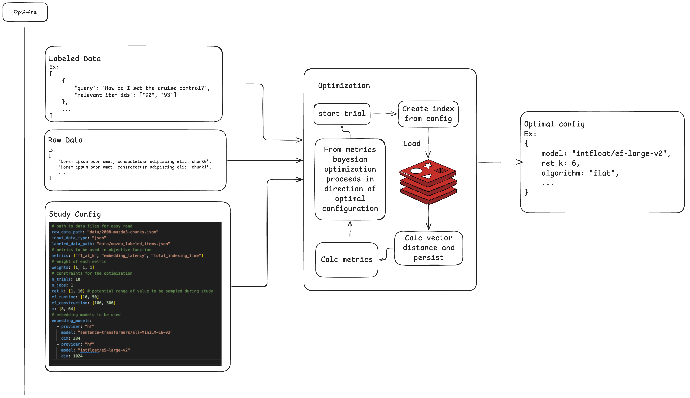
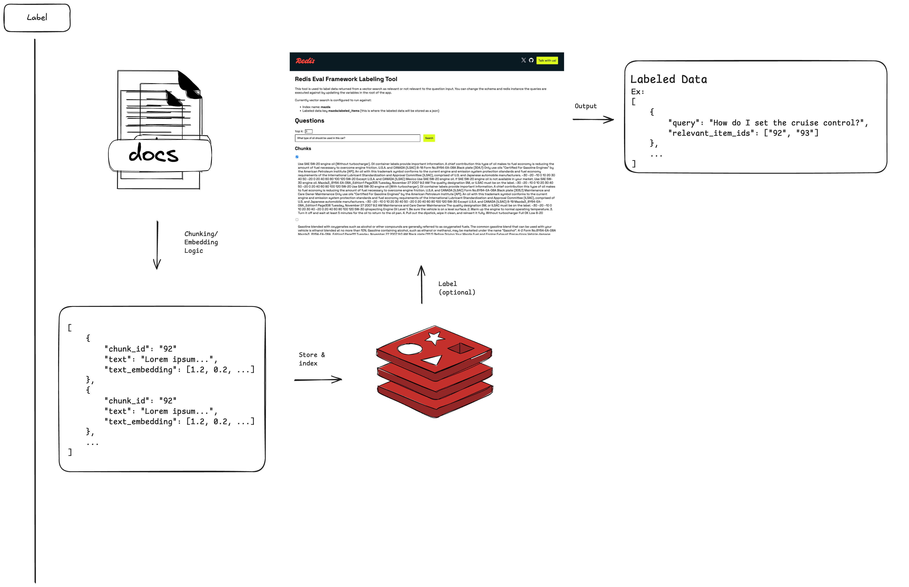
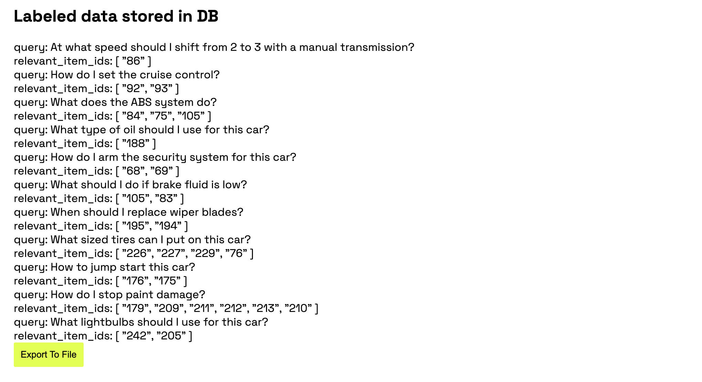

# Eval Framework

A tool for finding the optimal set of hyperparameters for retrieval from a vector index.

## I/O

Input: set of chunks to be indexing and retrieved, set of queries and their corresponding relevant_item_ids (these id should be canonical aka unique to each chunk), and a study config. For an example see [label_app/data/mazda-labeled.json](label_app/data/mazda-labeled.json) and [label_app/data/2008-mazda3-chunks.json](label_app/data/2008-mazda3-chunks.json)

Output: best configuration for search index.

## General flow

The primary optimize flow takes 3 inputs: labeled data, raw data, and the study config. These input are used to run the relevant trials from which the best configuration is chosen.



If you do not already have a labeled set of data you can use the labeling tool to make it easier to select which chunks are relevant to a given question and output the results to a file that can be used in the optimization flow.



## Defining the study config

The study config looks like this (see ex_study_config.yaml in the root of the project):

```yaml
# path to data files for easy read
raw_data_path: "label_app/data/2008-mazda3-chunks.json"
input_data_type: "json"
labeled_data_path: "label_app/data/mazda_labeled_items.json"
# metrics to be used in objective function
metrics: ["f1_at_k", "embedding_latency", "total_indexing_time"]
# weight of each metric
weights: [1, 1, 1]
# constraints for the optimization
n_trials: 10
n_jobs: 1
ret_k: [1, 10] # potential range of value to be sampled during study
ef_runtime: [10, 50]
ef_construction: [100, 300]
m: [8, 64]
# embedding models to be used
embedding_models:
  - provider: "hf"
    model: "sentence-transformers/all-MiniLM-L6-v2"
    dim: 384
  - provider: "hf"
    model: "intfloat/e5-large-v2"
    dim: 1024
```

#### raw_data_path should link to a json file in either of the following forms.

List of raw_chunks:
```json
[
  "chunk0",
  "chunk1",
  "..."
]
```

List of chunks with appropriate form:
```json
[
  {
    "text": "page content of the chunk",
    "item_id": "abc:123"
  }
]
```

**Note:** if the item_id is not specified in the input type it will be assumed to be the positional index of the chunk at retrieval.

#### labeled_data_path should link to a json file of the following form:
```json
[
  {
    "query": "How long have sea turtles existed on Earth?",
    "relevant_item_ids": ["1", "54", "42"]
  }
]
```

## Running Optimization

If you already have a labeled data file running the optimization is as simple as:

```
poetry run python -m optimize.main --config optimize/ex_study_config.yaml
```

Note if you haven't already:
```
pip install -r requirements.txt
```

## Labeling data

The labeling tool is early stage but can be run locally to create a json if labeled data as shown above.

```
touch process_data/.env
```

in process_data/.env
```
REDIS_URL=<Redis connection url>
LABELED_DATA_PATH=<file location for exported output>
EMBEDDING_MODEL=sentence-transformers/all-MiniLM-L6-v2
SCHEMA_PATH=schema/index_schema.yaml

# Corresponding fields to return from index see label_app/main.py for implementation
ID_FIELD_NAME=canonical chunk id
CHUNK_FIELD_NAME=text content
```

## Running the labeling ui

The following commands will serve the app to `localhost:8000/label`.
You can also interact with the swagger docs at `localhost:8000/docs`

With docker (recommended):

```
docker compose up
```

#### This will run a redis instance on 6379 and redis insight (database gui) on 8001.

Locally with python/poetry
```
poetry install
poetry run uvicorn label_app.main:app --host 0.0.0.0 --port 8000
```

Note: if you run locally need to run an instance of Redis. The easiest way to do this is with the following command: `docker run -d --name redis -p 6379:6379 -p 8001:8001 redis/redis-stack:latest`

## Populating the index

See `label_app/process_data.ipynb` to load sample chunks into the index for use.

Input question and check the boxes for chunks that are relevant.

raw_data_path is of form `['chunk1.....', 'chunk2....']`. TODO: add configurable chunking right now assumed chunks are defined.

Once satisfied click "Save Labeled" to add as a record to persisted db record. Finally click "Export To File" to output the file which can be used as the input to the optimization.


