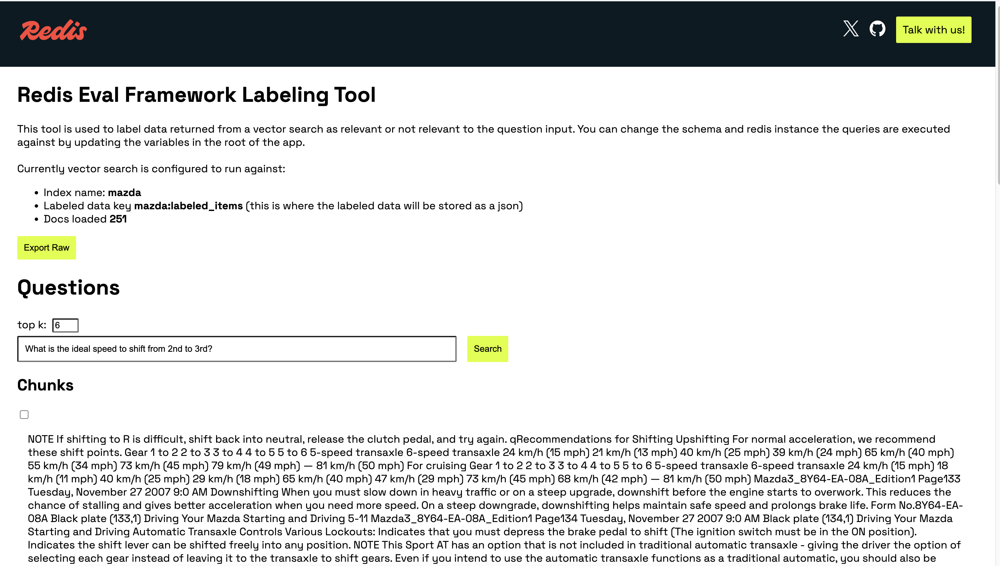

# Retrieval Optimizer

Let's say you are building an app that utilizes vector search in Redis but you're not sure which embedding model to use, what indexing algorithm, or how many results to return from your query. It can be daunting with all the potential configurations to figure out which of these settings is best for your specific data and use case. The goal of this project is to make all of this easier to figure out.

## How does it work?

This framework implements a fairly common pattern for optimizing hyperparameters called Bayesian Optimization. Bayesian Optimization works by building a probabilistic model (typically Gaussian Processes) of the objective function and iteratively selecting the most promising configurations to evaluate. Unlike grid or random search, Bayesian Optimization balances exploration (trying new regions of the parameter space) and exploitation (focusing on promising areas), efficiently finding optimal hyperparameters with fewer evaluations. This is particularly useful for expensive-to-evaluate functions, such as training machine learning models. By guiding the search using prior knowledge and updating beliefs based on observed performance, Bayesian Optimization can significantly improve both accuracy and efficiency in hyperparameter tuning.

In our case, we want to **maximize** the precision and recall of our vector search system while balancing performance tradeoffs such as embedding and indexing latency. Bayesian optimization gives us an automated way of testing all the knobs at our disposal to see which ones best optimize retrieval.

## What is required to getting going?

Note: for a hands-on example (recommended) see [examples/getting_started/retrieval_optimizer.ipynb](examples/getting_started/retrieval_optimizer.ipynb)

The primary optimize flow takes 3 inputs: labeled data, raw data, and the study config. These input are used to run the relevant trials from which the best configuration is determined.


## Raw data can be of the following forms

As a simple list of string content:
```json
[
  "chunk0",
  "chunk1",
  "..."
]
```

As a list of dict with attributes `text` and `item_id`:
```json
[
  {
    "text": "page content of the chunk",
    "item_id": "abc:123"
  }
]
```

**Note:** if the item_id is not specified in the input type it will be assumed to be the positional index of the chunk at retrieval.

#### labeled_data_path should be of the following form:
```json
[
  {
    "query": "How long have sea turtles existed on Earth?",
    "relevant_item_ids": ["abc:1", "def:54", "hij:42"]
  }
]
```

## Note: for the optimization to work the item_id needs to be unique and match with it's reference in relevant_item_ids

# Using the labeling tool

To make it easier to get started you can use the labeling tool within this project against your existing redis index to create the necessary input data for the optimization.

**Note:** If you have never populated a Redis vector index see [examples/getting_started/process_data.ipynb](examples/getting_started/process_data.ipynb). If you already have a Redis index running update the SCHEMA_PATH variable in your environment and proceed.


## Create .env
```
touch label_app/.env
```

in label_app/.env
```
REDIS_URL=<Redis connection url>
LABELED_DATA_PATH=<file location for exported output>
EMBEDDING_MODEL=sentence-transformers/all-MiniLM-L6-v2
SCHEMA_PATH=schema/index_schema.yaml

# Corresponding fields to return from index see label_app/main.py for implementation
ID_FIELD_NAME=unique id of a chunk or any item stored in vector index
CHUNK_FIELD_NAME=text content
```

## Run the gui

The following commands will serve the app to `localhost:8000/label`.
You can also interact with the swagger docs at `localhost:8000/docs`

With docker (recommended):

```
docker compose up
```

#### This will run a redis instance on 6379 and redis insight (database gui) on 8001.

Locally with python/poetry
```
poetry install
poetry run uvicorn label_app.main:app --host 0.0.0.0 --port 8000
```

Note: if you run locally need to run an instance of Redis. The easiest way to do this is with the following command: `docker run -d --name redis -p 6379:6379 -p 8001:8001 redis/redis-stack:latest`

## Once running

The app will connect to the index specified in whatever file was provided as part of the SCHEMA_PATH. By default this is [label_app/schema/index_schema.yaml](label_app/schema/index_schema.yaml) if it connects properly you will see the name of the index and the number of documents it has indexed.



From here you can start making queries against your index label the relevant chunks and export to a file for use in the optimization. This also a good way to get a feel for what's happening with your vector retrieval.

# Running the optimization
With the data either created manually or with the labeling tool, you can now run the optimization.

## Define the study config

The study config looks like this (see ex_study_config.yaml in the root of the project):

```yaml
# path to data files for easy read
raw_data_path: "label_app/data/2008-mazda3-chunks.json"
input_data_type: "json"
labeled_data_path: "label_app/data/mazda_labeled_items.json"
# metrics to be used in objective function
metrics: ["f1_at_k", "embedding_latency", "total_indexing_time"]
# weight of each metric
weights: [1, 1, 1]
# constraints for the optimization
n_trials: 10
n_jobs: 1
ret_k: [1, 10] # potential range of value to be sampled during study
ef_runtime: [10, 50]
ef_construction: [100, 300]
m: [8, 64]
# embedding models to be used
embedding_models:
  - provider: "hf"
    model: "sentence-transformers/all-MiniLM-L6-v2"
    dim: 384
  - provider: "hf"
    model: "intfloat/e5-large-v2"
    dim: 1024
```

## Running with command line

```
poetry install
```

If you already have a labeled data file running the optimization is as simple as:

```
poetry run python -m optimize.main --config optimize/ex_study_config.yaml
```

## For a step by step example
See [examples/getting_started/retrieval_optimizer.ipynb](examples/getting_started/retrieval_optimizer.ipynb)
